# Entra ID → AgentCore: Identity, RBAC & Token Exchange

> A browser sign-in with **Microsoft Entra ID** flows through a DataPower-style token exchange into a
> Bedrock **AgentCore** agent, a **Gateway**, and three **MCP** tool servers — validated and
> access-controlled at every tier. This is the whole design, drawn.

`Microsoft Entra ID` · `OAuth 2.0 / JWT` · `On-Behalf-Of exchange` · `AgentCore Runtime + Gateway` · `MCP` · `Role + Scope RBAC`

**Contents:** [01 Overview](#01--overview) · [02 Topology](#02--topology--trust-boundaries) ·
[03 Auth at each edge](#03--auth-at-each-edge) · [04 Token flow](#04--token-flow-sequence) ·
[05 Token exchange](#05--token-exchange--the-datapower-step) · [06 Agent internals](#06--agent-internals--request-lifecycle) ·
[07 Gateway & MCP](#07--gateway--mcp-tools--targets-namespacing-scoping) · [08 RBAC](#08--rbac--two-layers-two-claims) ·
[09 Components](#09--components--files) · [10 Gotchas](#10--hard-won-gotchas) · [11 Screenshots](#11--screenshots)

---

## 01 · Overview

A local single-page app signs the user in against **Microsoft Entra ID** and receives a JWT access
token (`T1`). That token passes through a local stand-in for the enterprise **DataPower** gateway,
which either forwards it or performs an **On-Behalf-Of** exchange for a second token (`T2`). The token
reaches a **Strands agent** on **AgentCore Runtime**, which validates it, enforces role-based access,
and forwards it to an **AgentCore Gateway**. The Gateway validates again and fans out over SigV4 to
three **MCP servers**. Identity is checked — and the token printed — at every hop.

---

## 02 · Topology & trust boundaries

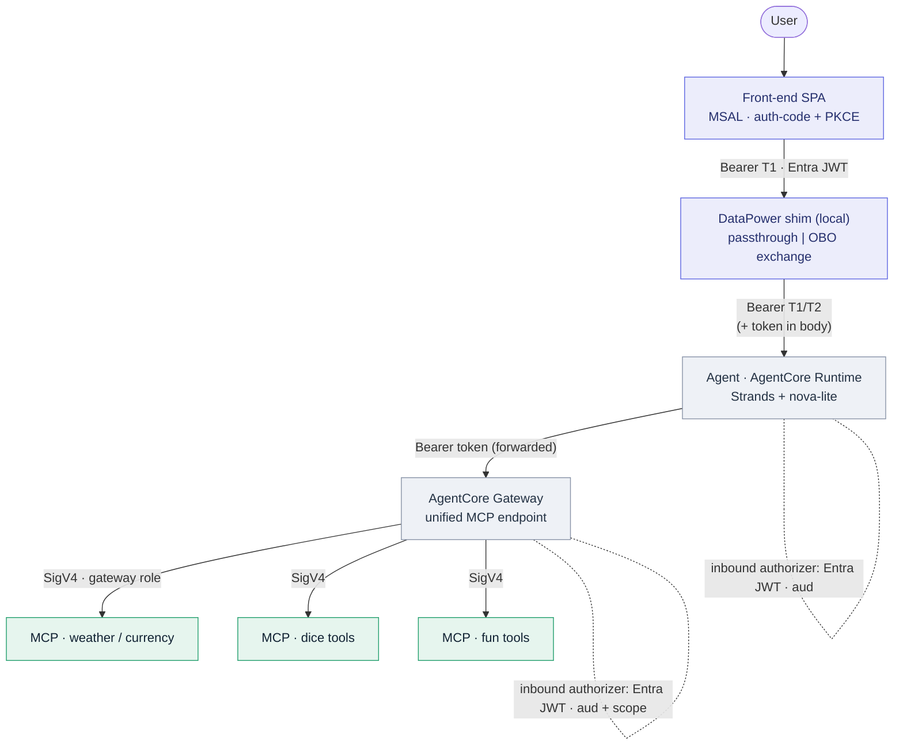

Solid arrows carry the request + bearer token. Dotted self-labels mark where an Entra JWT authorizer
validates before code runs. The Gateway→MCP hop switches to AWS **SigV4** (machine identity) — the
user's token does *not* automatically propagate past it.

---

## 03 · Auth at each edge

| Edge | Mechanism | What it proves / checks |
|---|---|---|
| `User → Front-end` | auth-code + PKCE | Interactive Entra sign-in (public client, no secret). Mints **T1** with `scp` + `roles`. |
| `Front-end → Shim` | Bearer T1 | Same-origin call to the local DataPower stand-in. |
| `Shim → Agent` | OBO exchange **or** passthrough | `MODE=exchange` swaps T1→T2 (real Entra OBO); `passthrough` forwards T1. Token also placed in the body. |
| `Agent (Runtime)` | Entra **custom JWT authorizer** | Validates issuer + signature + `aud`. Then reads the token from the body for RBAC + forwarding. |
| `Gateway` | Entra **custom JWT authorizer** | Validates `aud` + `allowedScopes:[mcp.invoke]` — the coarse "may use the gateway" gate. |
| `Gateway → MCP` | SigV4 (gateway role) | Machine-to-machine; the Gateway signs with its IAM role to invoke each MCP-server runtime. |

---

## 04 · Token flow (sequence)

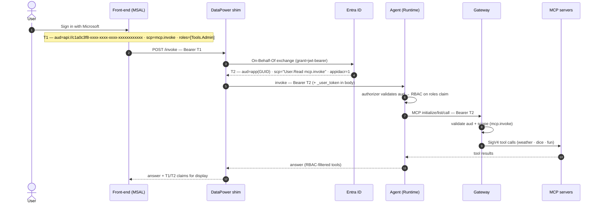

In `passthrough` mode steps 3–5 collapse to "forward T1". The agent always receives the token in the
request **body** because the Runtime strips the `Authorization` header after the authorizer validates it.

---

## 05 · Token exchange · the DataPower step

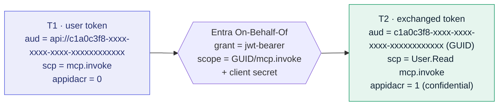

The shim's `MODE=exchange` is a stand-in for the enterprise DataPower box: it trades the inbound user
token for a fresh, downstream-scoped token, signed by the confidential middle-tier app.

Concretely, the shim POSTs T1 to Entra's token endpoint
`https://login.microsoftonline.com/{tenant}/oauth2/v2.0/token` with
`grant_type=urn:ietf:params:oauth:grant-type:jwt-bearer`, `assertion=<T1>`, `scope=<GUID>/mcp.invoke`,
and `requested_token_use=on_behalf_of`, authenticating with the app's **client secret** — Entra returns
T2 in the response. (Real DataPower makes the equivalent call; the client secret is why this step lives
in the confidential middle tier and not the browser.)

| | **T1 · from sign-in** (public client) | **T2 · exchanged** (confidential) |
|---|---|---|
| `aud` | `api://c1a0c3f8-xxxx-xxxx-xxxx-xxxxxxxxxxxx` | `c1a0c3f8-xxxx-xxxx-xxxx-xxxxxxxxxxxx` (not `api://`) |
| `iss` / `ver` | `sts.windows.net/4b7f45a9-xxxx-xxxx-xxxx-xxxxxxxxxxxx/` · 1.0 | `sts.windows.net/4b7f45a9-xxxx-xxxx-xxxx-xxxxxxxxxxxx/` · 1.0 |
| `appidacr` | `0` | **`1`** (confidential client used) |
| `scp` | `mcp.invoke` | `User.Read mcp.invoke` |
| `roles` | `[Tools.Admin]` | `[Tools.Admin]` (carried through) |

> **Why the exchange succeeds — three exact conditions:**
> ① Resource must be the **GUID**, not the `api://` URI (else `AADSTS90009`).
> ② Request the **specific** scope `c1a0c3f8-xxxx-xxxx-xxxx-xxxxxxxxxxxx/mcp.invoke`, not `.default` (which resolves to Graph
> `User.Read` only → fails the Gateway's scope gate).
> ③ One-time **admin consent** on the app's API permissions (else `AADSTS65001`).

### Live T2 in the token explorer

The exchanged **T2** as it lands in the front-end (Panel ②, the collapsible JSON tree). Note that `aud`
is the **GUID** form (`c1a0c3f8-xxxx-xxxx-xxxx-xxxxxxxxxxxx`, not `api://`), `scp` now carries **both** `User.Read` and
`mcp.invoke`, `appidacr: 1` marks the confidential-client exchange, and the agent's `agent_response`
shows the RBAC decision for a `Tools.Admin` user — `can_read: true`, `can_admin: true`:

[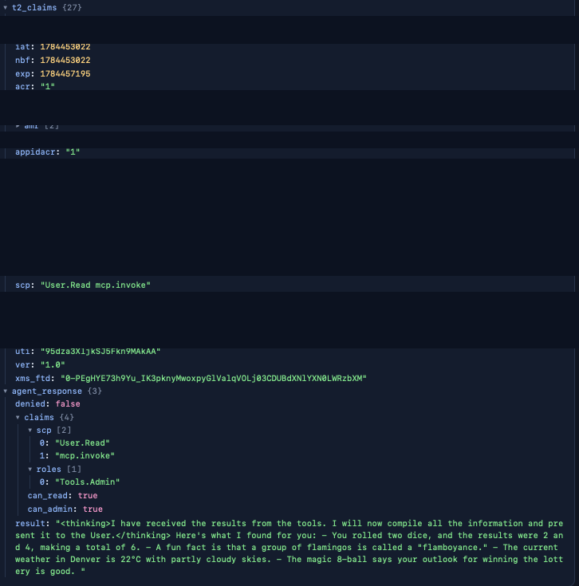](t2_token_claims.png)

---

## 06 · Agent internals · request lifecycle

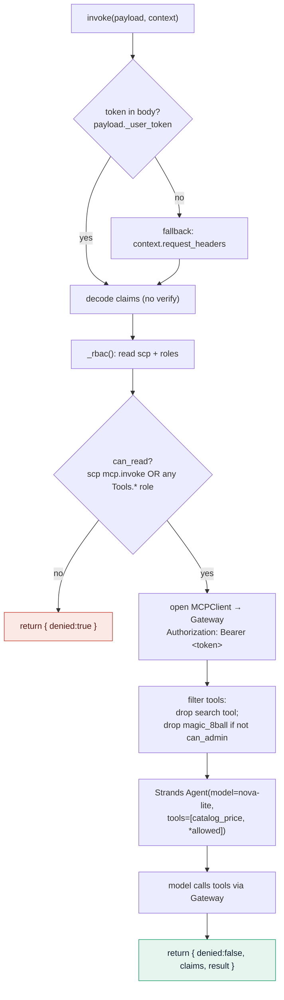

The agent is the enforcement point for *fine-grained* RBAC: it holds the decoded token and decides
which tools even reach the model. It also re-uses the same token to authenticate to the Gateway.

---

## 07 · Gateway & MCP tools · targets, namespacing, scoping

The Gateway is a single MCP endpoint that fronts multiple MCP-server runtimes. Each backend is a
**target**; the Gateway namespaces every tool as `{targetName}___{tool}` and reaches the backend over
SigV4.

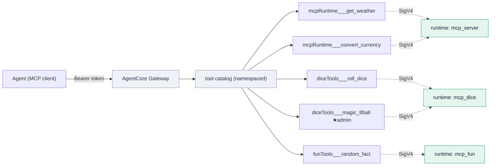

> **Scoping constraint · tool names.** Target names must be hyphen-free camelCase (e.g. `mcpRuntime`,
> `diceTools`). The target-name regex forbids underscores, and **Nova models reject tool names
> containing hyphens** (invalid ToolUse). So `diceTools___magic_8ball` is valid;
> `dice-tools___magic_8ball` breaks the model.

**Two-tier scoping** — "scope" means two different things here, and both matter:

| Tier | What "scope" means | Enforced by |
|---|---|---|
| OAuth scope | The `mcp.invoke` permission in the token's `scp` claim — "may call the Gateway at all". | Gateway authorizer `allowedScopes` |
| Tool visibility | Which namespaced tools the agent exposes to the model, per the `roles` claim. | Agent code (`gateway_agent.py`) |

---

## 08 · RBAC · two layers, two claims

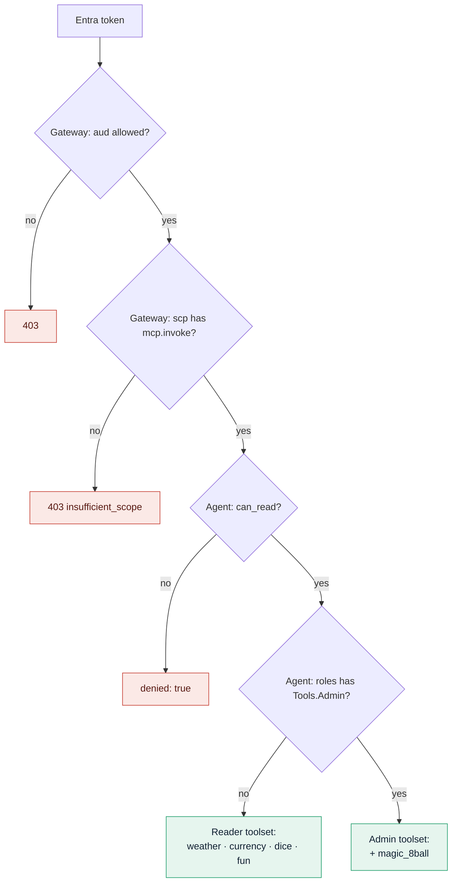

| Role | can_read | can_admin | weather · dice · fun | `magic_8ball` |
|---|---|---|---|---|
| `Tools.Reader` | ✅ true | ⛔ false | ✅ allowed | ⛔ hidden |
| `Tools.Admin` | ✅ true | ✅ true | ✅ allowed | ✅ allowed |

The admin gate is keyed off the Entra app **role**, in code — not a per-tool Entra scope:

```python
# gateway/gateway_agent.py
ADMIN_TOOL_MARKER = "magic_8ball"

def _rbac(c):
    scp   = set((c.get("scp") or "").split())
    roles = set(c.get("roles") or [])
    can_read  = {"mcp.invoke"} & scp or {"Tools.Reader", "Tools.Admin"} & roles
    can_admin = "Tools.Admin" in roles            # <- the admin gate
    return {"can_read": bool(can_read), "can_admin": can_admin}

# before building the toolset:
if ADMIN_TOOL_MARKER in name and not rb["can_admin"]:
    continue                                       # hide from non-admins
```

---

## 09 · Components & files

| Component | File(s) | Role |
|---|---|---|
| Front-end SPA | `frontend/index.html` · `config.js` | MSAL sign-in; renders every token/claim. Served by the shim (same origin). |
| DataPower shim | `datapower/shim.py` | Local FastAPI; OBO exchange or passthrough; proxies to the agent; prints T1/T2. |
| Agent | `gateway/gateway_agent.py` | Strands agent on Runtime; Entra inbound; reads token from body; role RBAC; forwards to Gateway. |
| Gateway setup | `gateway/setup_gateway.py` | Creates the Entra-secured Gateway + 3 MCP-server targets; builds the authorizer config. |
| MCP servers | `mcp_server/` · `mcp_dice/` · `mcp_fun/` | FastMCP tool servers on Runtime (IAM inbound), fronted by the Gateway. |
| Config & ops | `entra/.env` · `run_frontend.sh` · `rebuild_entra_stack.sh` | Entra identifiers (gitignored secret); one-command run + rebuild. |

---

## 10 · Hard-won gotchas

- **v1 vs v2 tokens.** This app issues **v1.0** tokens (`iss=sts.windows.net`, `aud=api://c1a0c3f8-xxxx-xxxx-xxxx-xxxxxxxxxxxx`). Use the
  **v1 discovery URL** (no `/v2.0`) and set `allowedAudience` to both the `api://` URI and the bare client id.
- **Do not set `allowedClients`.** The authorizer checks it against a `client_id` claim, but Entra v1
  tokens carry the client in `appid`. Result: Runtime **401** "client_id value mismatch"; Gateway **403**
  "insufficient_scope" (same cause, misleading label). Validate on `allowedAudience` + `allowedScopes` only.
- **The Runtime strips `Authorization`.** After the JWT authorizer validates, the Runtime removes the
  header — the container never sees the bearer token. Pass it in the request **body** (`_user_token`).
- **Container build context** is the entrypoint's own dir — `from common.tokentap import…` yields
  `ModuleNotFoundError` → "error when starting the runtime". Inline shared helpers into the agent file.
- **Usable OBO on a single app (fix).** Exchange for `c1a0c3f8-xxxx-xxxx-xxxx-xxxxxxxxxxxx/mcp.invoke` (specific scope, GUID resource)
  + admin consent → T2 carries `mcp.invoke` and the Gateway accepts it. `.default` gives the wrong scope.
  Real DataPower exchanges for a distinct downstream audience.
- **Front-end plumbing.** The MSAL CDN is often blocked on corporate networks (404) → **bundle it
  locally**. Corp tenants require an **https** redirect URI → serve over TLS. **Safari** fights
  self-signed certs on `fetch` → use Chrome/Edge. Device-code flow fails when the app has a secret →
  use the SPA + PKCE browser flow.

---

## 11 · Screenshots

Console + UI captures of the pieces above. Click any image to open it full-size.

### Microsoft Entra ID

**App registration** — the single app acting as *both* the SPA client and the API resource (Expose an
API, app roles, and a client secret all on one registration).

[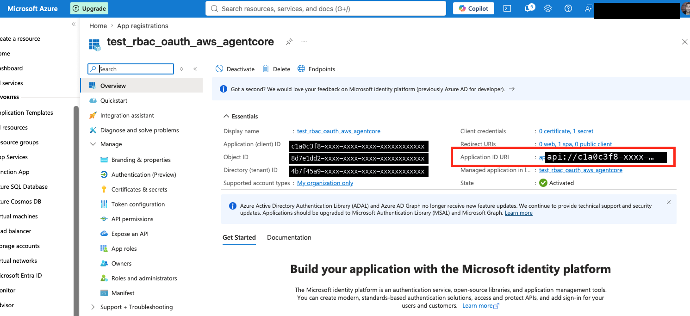](entra_id_app_setup.png)

**API permissions** — the `mcp.invoke` delegated scope with admin consent granted (green).

[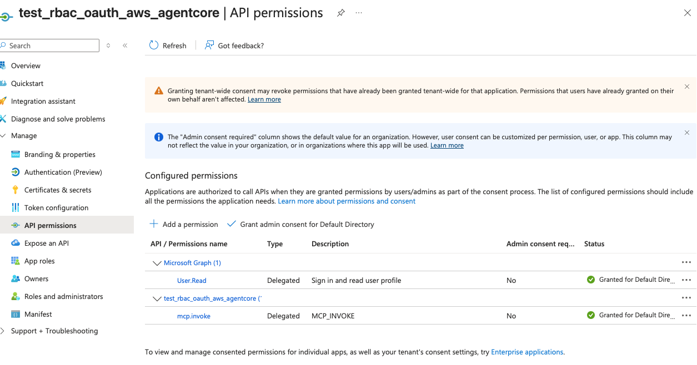](entra_id_api_permissions.png)

**User → app-role assignment** — assigning `Tools.Admin` / `Tools.Reader` to the user on the Enterprise
application (this is what puts the `roles` claim in the token).

[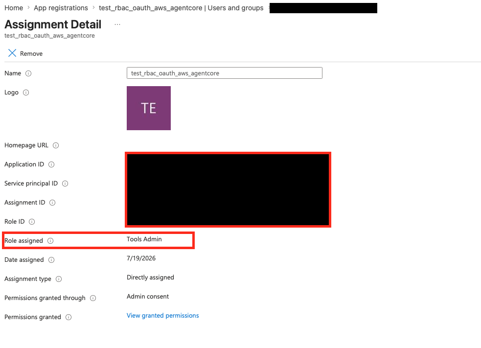](entra_id_user_assignment_to_roles.png)

### AWS AgentCore

**Runtime** — the deployed agent and the MCP-server runtimes.

[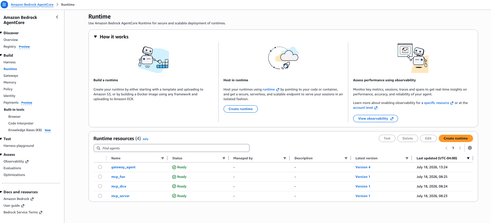](agentcore_runtime_with_agent_and_mcpservers.png)

**Gateway** — the unified MCP endpoint with its targets.

[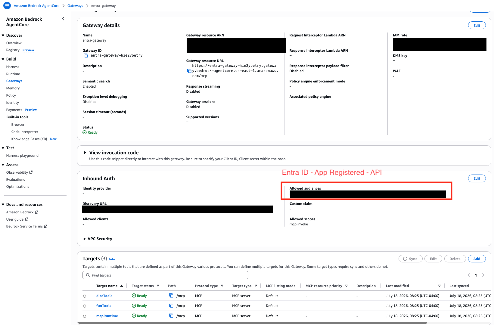](agentcore_gateway_with_mcp.png)

### End-to-end test

**T1 → T2 token exchange** through the DataPower shim into the AgentCore agent (the front-end token
explorer).

[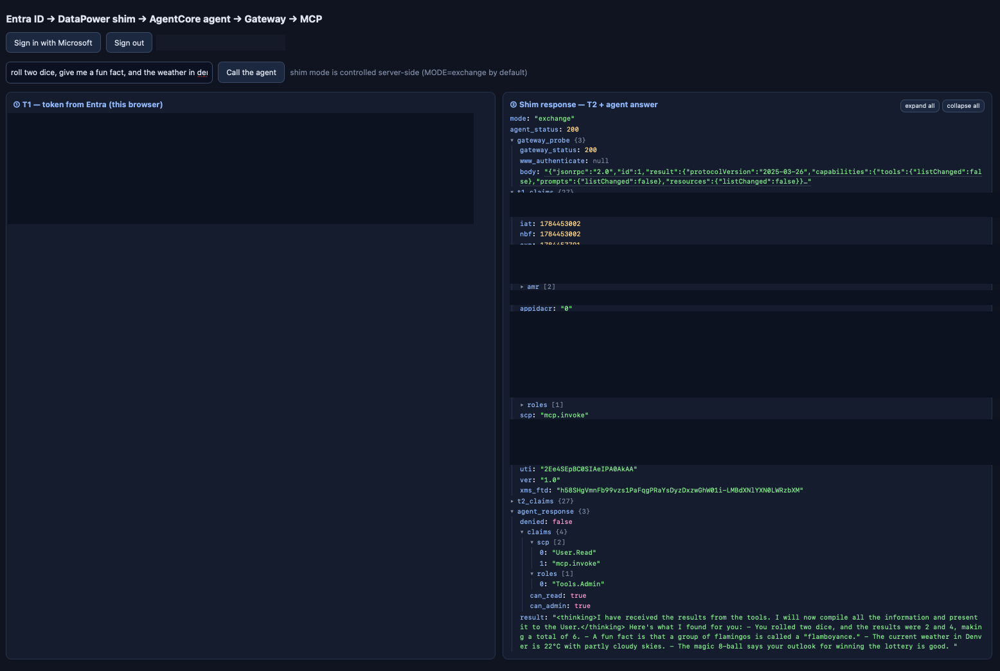](test_entra_tokent1_t2_token_shim_agentcore.png)

---

*AWS training sandbox · Bedrock AgentCore + Strands + Microsoft Entra ID. Full gotcha log also lives in
`CLAUDE.md`; rebuild the stack with `./rebuild_entra_stack.sh`.*
